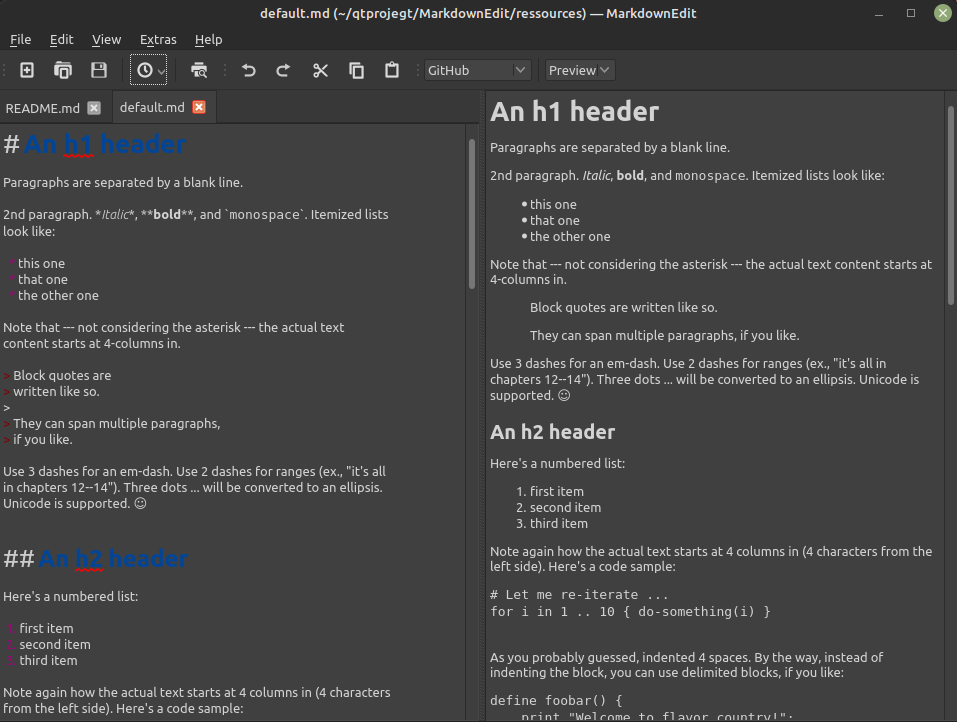

[](https://qt.io)
[](https://www.codefactor.io/repository/github/software-made-easy/markdownedit/overview/main)
[](https://www.gnu.org/licenses/gpl-3.0)
[](https://github.com/software-made-easy/MarkdownEdit/releases/)


# [MarkdownEdit](https://software-made-easy.github.io/MarkdownEdit/)

MarkdownEdit, as the name suggests, is a simple and easy program for creating and editing Markdown files.

## Table of contents

1. [Features](#features)
2. [Preview](#preview)
3. [Dependencies](#dependencies)

-------

## Features:

- Spell checker
- Save and load Markdown files
- Undo-Redo
- Preview Markdown files in real time (<1 ms)
- Syntax highlighting editor
- Auto-complete (close brackets, list, ...)
- Find/Replace(Ctrl+F/Ctrl+R)
- Export to HTML and PDF
- Bad in resources
- Quick opening of recent files (Button in toolbar or in the file menu)
- Open source
- Native look and feel
- Remember spelling language for every document



## Preview

A preview is available [here](https://software-made-easy.github.io/MarkdownEdit/markdownedit.html).

Important:
- Performance might be bad
- Some functions such as spellchecking are not available

## Dependencies:

[Qt](https://qt.io/) and [enchant-2](https://github.com/AbiWord/enchant).

## Note(s):

- To improve performance when using images, disable the "Auto add file path to icon path" option (menu <u>V</u>iew).


-------

## Build instructions

Run the [build script](scripts/build.sh) or follow the instructions below.

- Clone MarkdownEdit: `git clone https://github.com/software-made-easy/MarkdownEdit --depth=1 && cd MarkdownEdit`
- Clone all repositories required by MarkdownEdit by running the command `git submodule update --init --recursive -j 3 --depth=1`.
- Create the build folder: `mkdir build && cd build`.
- Now create a Makefile with CMake: `cmake ..`.
- Build it: `cmake --build . -j4`

In summary:
```bash
git submodule update --init --recursive -j 3 --depth=1
mkdir build && cd build
cmake ..
cmake --build . -j4
```

## Credits

- The conversion from Markdown to HTML is done with the help of the [md4c](https://github.com/mity/md4c) - library by *Martin Mitáš*.
- The [widget](https://github.com/pbek/qmarkdowntextedit) used for writing was created by *Patrizio Bekerle*.
